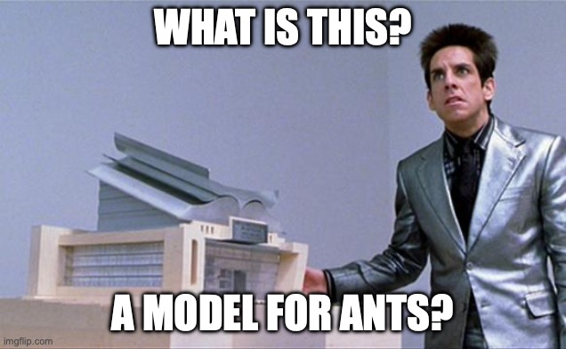

## This semester

- Build a foundation for statistical inference (linear regression)
- How to think about your analyses *before* you collect data
- Identify common pitfalls in statistical inference

## An aside on p-values

- The final will have a p-value question because you will be inundated with p-values in your career

- We will not touch p-values for as long as possible (after first exam)

## Framework for understanding

- People struggle with stats and the analysis of data for two main reasons: 
 
 1. Jargon. There is no way to avoid that stats is like a second language. 
 2. Translation of theory to analysis. This necessitates the integration of experimental design, data collection, and an analytic framework.  


## GLM

-   General(ized) Linear Model aka linear regression

-   A workhorse that is responsible for \>99% of statistical tests in psychology, as well as the building block of many machine learning models

-   We will use the GLM equation to describe all of our analyses. Basis for communication to others. 


## What do we mean by General(ized)?

-   It is *general* in that it refers to a broad set of similar models that can applied to almost any context

- Serves as the default

## {background-video="https://packaged-media.redd.it/8uql22tz6mb81/pb/m2-res_480p.mp4?m=DASHPlaylist.mpd&v=1&e=1755630000&s=64d199dca3fbecf869a5253e95f6ab5734c5439b"}


## What do we mean by linear?

-   We try to understand our dependent variable (DV) via a linear combination predictor variables.

-   A linear combination is a way of combining things (variables) using scalar multiplication and addition


## What is a model?


## What is a model?

-   A representation of the world
-   A **statistical** model uses math to make predictions and thus learn about the world


## YOU DEFINE THE MODEL

- For the DV you care about, what do you think impacts it? What is your theory? 

- We need to collect data to have those variables to put into your model

- Need to then describe how those variables relate to one another

## Middle School Math

$$ y = mx + b $$ 

-  what is $y$?

-   what is $m$?

-   what is $x$?

-   what is $b$?

## Let's rewrite this

$$Y = b_0 + b_{1}X$$

-   what is $Y$?

-   what is $b_0$?

-   what is $b_1$?

-   what is $X$?

## Are models always right?




## MODELS ARE FLAWED

-   How do we compensate?

$Y = b_0 + b_{1}X + e$


## How do we know if a model is good?

-   What makes it good?

## How will we use models?

-   This semester, we will mainly focus on classic statistical tests. Every single one of these is a model.

-   Think of a model before you design your experiment. 

-   Scaffolding for more complex models. 

## How can we visualize data to make sense of it?

```{r}
#| code-fold: true
library(broom)
set.seed(123)
x.1 <- rnorm(100, 0, 1)
e.1 <- rnorm(100, 0, 2)
y.1 <- .5 + .55 * x.1 + e.1
d.1 <- data.frame(x.1,y.1)
m.1 <- lm(y.1 ~ x.1, data = d.1)
d1.f<- augment(m.1)
d.1
```

------------------------------------------------------------------------

```{r}
#| code-fold: true
library(tidyverse)
ggplot(d1.f , aes(x=x.1, y=y.1)) +
    geom_point(size = 2)
```

## Models are lines

```{r}
#| code-fold: true
ggplot(d1.f , aes(x=x.1, y=y.1)) +
    geom_point(size = 2) +
  geom_smooth(method = lm, se = FALSE) 
```

## How do we visualize categorical data?

Nominal/categorical data does not have any inherent numbers associated with it. Think control/tx, eye color, etc.

```{r}
#| code-fold: true
set.seed(123)
group <- c(0, 1)
x.2 <- rep(group, times = 50)
e.1 <- rnorm(100, 0, 1)
y.1 <- .5 + .85 * x.2 + e.1
d.2 <- data.frame(x.2,y.1)
m.2 <- lm(y.1 ~ x.2, data = d.2)
d2.f<- augment(m.2)
d.2
```

------------------------------------------------------------------------

```{r}
#| code-fold: true
ggplot(d2.f , aes(x=x.2, y=y.1)) +
    geom_point(size = 2) +
  geom_smooth(method = lm, se = FALSE) 
```

------------------------------------------------------------------------

```{r}
#| code-fold: true
ggplot(d2.f,
       aes(x = as.factor(x.2),
           y = y.1)) +
  geom_violin(aes(fill = as.factor(x.2)),
              alpha = .3,
              show.legend = FALSE) +
  geom_boxplot(aes(color = as.factor(x.2)),
               fill = "white",
               width = .2) +
  geom_jitter(aes(color = as.factor(x.2))) +
  labs(x = "Treatment",
       y = "y")
```

## What do these visualizations have in common?

. . .

LINES!

Most of what we are going to do is represent the relationship between variables with lines (or planes or hyperplanes once we get into 2 or more variables)

## Thinking in terms of models

-   Models help us draw the lines

-   Our DV (here forth Y) is what we are trying to understand

-   We hypothesize it has some relationship with your IV(s) (hence forth Xs), with what is left over described as error (E)

$y = b_0 + b_{1}X + e$

-   $b_{1}$ describes the strength of association i.e. the line!

## Regression Equation

$$Y_i = b_{0} + b_{1}X_i +e_i$$

-   $Y_i \sim Normal(\mu, \sigma)$

-   The DV, $Y$ is assumed to be distributed as a Gaussian normal, made up of $Y_i$, with a mean of $\mu$ and a standard deviation of $\sigma$

## Regression terms

-   Y / DV / Outcome / Response / Criterion
-   X / IV / Predictor / Explanatory variable
-   Regression coefficient (weight) / b / b\* / $\beta$
-   Intercept $b_0$ / $\beta_{0}$
-   Error / Residuals $e$
-   Predictions $\hat{Y}$

## Regression models

-   These models are a way to convey the relationship between two (or more) variables. They translate our hypotheses into math.

-   We can use these models to get information we may be interested in (e.g. means, SEs) and test hypotheses about the relationship among variables

-   *"All models are wrong but some are useful (and some are better than others)"* - George Box

## Parts of the model

$$Y_i = b_{0} + b_{1}X_i + e_i$$ $$T.risk_i = b_{0} + b_{1}TX_i + e_i$$

-   Each individual has a unique Y value an X value and a residual/error term\
-   The model only has a single $b_{0}$ and $b_{1}$ term. These are the regression parameters. $b_{0}$ is the intercept and $b_{1}$ quantifies the relationship between your model of the world and the DV.


