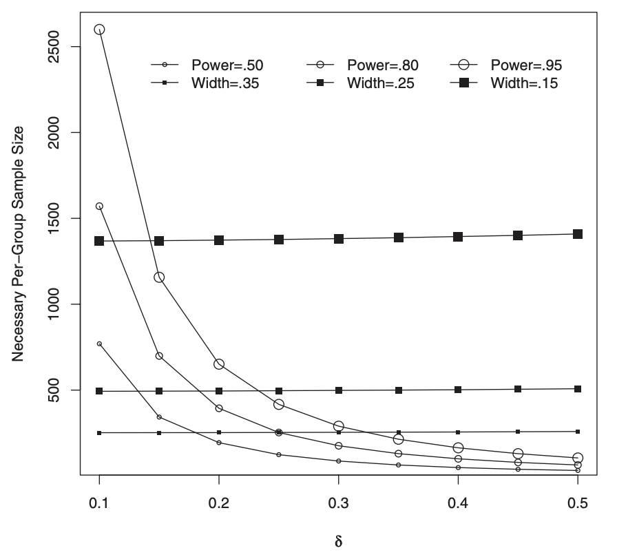

## This time

- Power! Or, why we should do studies so they succeed (if they are supposed to succeed)

## Errors we make

|  | Fail to reject null | reject null | 
|------------|------------|------------|
| $H_0$ is True    | Correct decision   |    Type 1 error (false positive) | 
| $H_0$ is False      | Type II error (False Negative) |   Correct decision  |


## NHST and errors

- We directly control Type I errors via alpha level. 

- Controlling Type II errors is more challenging because it depends on several factors. Some argue that the null hypothesis is usually false, so the only error we can make is a Type II error -- a failure to detect a signal that is present.


## Power

- The complement of a Type II error is statistical power. 

- Power is the probability of correctly rejecting a false null hypothesis. It is the ability to detect an effect, if an effect is truly there.

α -- The rate at which we make Type I errors.  
β -- The rate at which we make Type II errors.  
1 − β -- statistical power.  

-----------

- Controlling Type II errors is the goal of power analysis and must contend with four quantities that are interrelated:

Sample size. 

Effect size. 

Significance level (α). 

Power. 

- When any three are known, the remaining one can be determined. 

- We must specify a specific value for the alternative hypothesis (e.g., our expected effect size) to estimate and control Type II errors.

## Example

Suppose we have a measure of social sensitivity that we have administered to a random sample of 20 psychology students. This measure has a population mean (μ
) of 10 and a standard deviation (σ) of 2. We suspect that psychology students are more sensitive to others than is typical and want to know if their mean, which is 11, is sufficient evidence to reject the null hypothesis that they are no more sensitive than the rest of the population.

We would also like to know how likely it is that we could make a mistake by concluding that psychology students are not different when they really are: A Type II error.

## Example

- Where would our critical value be? 

```{r}
10 + (qt(df = 20,.975) * (2/sqrt(20)))
```

```{r}
#| code-fold: true
library(ggplot2)
library(tidyverse)
library(ggdist)
library(distributional)

df <- tribble( ~df, ~mu, ~sigma, 20, 10, .44)

 ggplot(df, aes(xdist = distributional::dist_student_t(df, mu, sigma))) +
  stat_slab(aes())+
   annotate("rect", xmin=10.93287, xmax=Inf, ymin=0, ymax=Inf, alpha=0.2, fill="red")  
```


## Alternative distribution

- Just as when we centered our sampling distribution around the null merely for doing NHST.... 

- We can center a sampling distribution around our hypothesized (or observed) effect size. 

- They will have the same width. 


-------

```{r}
#| code-fold: true

distributions_df <- tribble(
  ~distribution,      ~df, ~mu, ~sigma,
  "Null (H0)",        20,  10,   0.44,
  "Alternative (H1)", 20,  11,   0.44
)

# --- Step 2: Define the Critical Value ---
critical_value <- 10.93287

ggplot(distributions_df, aes(
    xdist = distributional::dist_student_t(df = df, mu = mu, sigma = sigma)
  )) +  stat_dist_slab(
    alpha = 0.4,
    xlim = c(10.93287, "inf")
  ) +

  stat_dist_slab(
    data = . %>% filter(distribution == "Null (H0)"),
    alpha = 0.6) +

  geom_vline(xintercept = critical_value, linetype = "dashed", color = "darkred", size = 1) +
  
  labs(
    title = "Visualizing Statistical Power",
    subtitle = "Comparing the Null (H0) and Alternative (H1) Distributions",
    x = "Sample Mean",
    y = "Density"
  )

```


-----------


```{r}
#| code-fold: true
distributions_df <- tribble(
  ~distribution,      ~df, ~mu, ~sigma,
  "Null (H0)",        20,  10,   0.44,
  "Alternative (H1)", 20,  14,   0.44
)

# --- Step 2: Define the Critical Value ---
critical_value <- 10.93287

ggplot(distributions_df, aes(
    xdist = distributional::dist_student_t(df = df, mu = mu, sigma = sigma)
  )) +  stat_dist_slab(
    alpha = 0.5,
    xlim = c(10.93287, "inf"),
    normalize = "all" # Ensures curves are scaled relative to each other
  ) +

  stat_dist_slab(
    data = . %>% filter(distribution == "Null (H0)"),
    alpha = 0.7) +

  geom_vline(xintercept = critical_value, linetype = "dashed", color = "darkred", size = 1) +
  
    geom_vline(xintercept = 14, linetype = "dashed", color = "black", size = 1) +
  
  labs(
    title = "Visualizing Statistical Power",
    subtitle = "Comparing the Null (H0) and Alternative (H1) Distributions",
    x = "Sample Mean",
    y = "Density"
  )

```


-----------


```{r}
#| code-fold: true

distributions_df <- tribble(
  ~distribution,      ~df, ~mu, ~sigma,
  "Null (H0)",        20,  10,   0.44,
  "Alternative (H1)", 20,  10.5,   0.44
)

# --- Step 2: Define the Critical Value ---
critical_value <- 10.93287

ggplot(distributions_df, aes(
    xdist = distributional::dist_student_t(df = df, mu = mu, sigma = sigma)
  )) +  stat_dist_slab(
    alpha = 0.5,
    xlim = c(10.93287, "inf"),
    normalize = "all" # Ensures curves are scaled relative to each other
  ) +

  stat_dist_slab(
    data = . %>% filter(distribution == "Null (H0)"),
    alpha = 0.7) +

  geom_vline(xintercept = critical_value, linetype = "dashed", color = "darkred", size = 1) +
  
    geom_vline(xintercept = 10.5, linetype = "dashed", color = "black", size = 1) +
  
  labs(
    title = "Visualizing Statistical Power",
    subtitle = "Comparing the Null (H0) and Alternative (H1) Distributions",
    x = "Sample Mean",
    y = "Density"
  )

```


## Beta

- The rate that we make type II errors (not regression parameter, sorry). Area under curve to the left of our critical value. 


```{r}
#| code-fold: true

distributions_df <- tribble(
  ~distribution,      ~df, ~mu, ~sigma,
  "Null (H0)",        20,  10,   0.44,
  "Alternative (H1)", 20,  11,   0.44
)

# --- Step 2: Define the Critical Value ---
critical_value <- 10.93287

ggplot(distributions_df, aes(
    xdist = distributional::dist_student_t(df = df, mu = mu, sigma = sigma)
  )) +  stat_dist_slab(
    alpha = 0.4
  ) +

  stat_dist_slab(
    data = . %>% filter(distribution == "Alternative (H1)"),
    alpha = 0.6,
    fill = "green") +
  
  geom_vline(xintercept = critical_value, linetype = "dashed", color = "darkred", size = 1) +
  
  labs(
    title = "Beta (type 2 error) is AUC left of C.V.",
    subtitle = "Power is AUC right of C.V.",
    x = "Sample Mean",
    y = "Density"
  )

```

----------------------

- In the long run, if our samples have a mean of 11 (σ = 2 , N = 20), we will correctly reject the null with probability of .56 (power). We will incorrectly fail to reject the null with probability of .44 (β). 

```{r}
# c.v. 10.93287 from before
(10.93 - 11) / (2/sqrt(20)) # standardized CV from alternative

pt(df = 20, -0.1565248) # Beta / Type 2

1 - .4386 # power
```
- EVEN IF 11 IS TRUE, our experiment will be for naught almost 1/2 the time!!

## Increase sample size

- You should never collect just 20 subjects. What happens when we collect more? 
```{r}
#| code-fold: true

distributions_df <- tribble(
  ~distribution,      ~df, ~mu, ~sigma,
  "Null (H0)",        75,  10,   0.23,
  "Alternative (H1)", 75,  11,   0.23
)

# --- Step 2: Define the Critical Value ---
critical_value <- 10 + (qt(df = 75,.975) * (2/sqrt(75)))

ggplot(distributions_df, aes(
    xdist = distributional::dist_student_t(df = df, mu = mu, sigma = sigma)
  )) +  stat_dist_slab(
    alpha = 0.4
  ) +

  stat_dist_slab(
    data = . %>% filter(distribution == "Alternative (H1)"),
    alpha = 0.6,
    fill = "green") +
  
  geom_vline(xintercept = critical_value, linetype = "dashed", color = "darkred", size = 1) +
  
  labs(
    title = "Beta (type 2 error) is AUC left of C.V.",
    subtitle = "Power is AUC right of C.V.",
    x = "Sample Mean",
    y = "Density"
  )

```


----------

```{r}
10 + (qt(df = 75,.975) * (2/sqrt(75))) # c.v. under null
(10.46 - 11) / (2/sqrt(75)) # standardized c.v. under alternative

pt(df = 75, -2.338269) # Beta / Type 2

1 - .01 # power
```

-----------

https://rpsychologist.com/d3/nhst/


## Power is for all types of statistics

- Example that we covered is for estimating the mean. But just as we can create a sampling distribution for any statistic, we can calculate power for any statistic. 

- The smaller the standard error, the higher the statistical power, all else being equal.

- Statistical power is your ability to reliably detect the signal (your statistic) through the noise (standard error)

- Anything that leads to a higher t-stat (which we used for NHST) will increase power


## How can power be increased?

- Increase effect size (move alternative father away)

- increase your alpha (.056), which moves your critical value closer to the null

- increase N (reduces standard error --> more precision)

- Reduce observed standard deviation/sigma via better measurement or a better manipulation

## How do you choose an effect size?

- Past research can often provide some guidance, especially if a meta-analysis is available.

- Afield might have standards regarding what counts as a meaningful effect (e.g., minimal clinically important difference).

- Abstract benchmarks or rules of thumb about what are “small,” “medium”, and “large” effects.

## Packages

- There are many helper packages to do power analyses

{pwr} {simr} {pwrss} {InteractionPoweR} among others

- You have to be careful that for some packages they focus on either the omnibus model versus specific coefficients

- For some models there are no analytic solutions and one must simulate

## pwr

- Can only do very simple models. Rather than specifying your regression model, it asks you to pick a type of model. 

- Cannot do standard regression! Booo

```{r}
#| code-fold: true
library(pwr)
pwr::pwr.t.test(n = NULL,
                sig.level = 0.05, 
                type = "two.sample", 
                alternative = "two.sided", 
                power = 0.80, 
                d = .4)
```


## pwrss

- much better than pwr

```{r}
#| code-fold: true
library(pwrss)
power.t.regression(beta = 0.40,
                   sd.outcome = 1.2,
                   sd.predictor = .8,
                   k.total = 1,
                   r.squared = 0.09,
                   power = .80,
                   alpha = 0.05,
                   alternative = "two.sided")
```

---------

```{r}
#| code-fold: true
power.t.regression(beta = 0.30,
                   k.total = 1,
                   r.squared = 0.09,
                   power = .80,
                   alpha = 0.05,
                   alternative = "two.sided")
```

----------


```{r}
#| code-fold: true
power.z.onecor(rho = 0.30,
               null.rho = 0.0,
               power = 0.80,
               alpha = 0.05,
               alternative = "one.sided")
```

## Simulating power

```{r}
#| code-fold: true

# --- Define the Simulation Parameters ---

n_simulations <- 10000
sample_size <- 103
alpha <- 0.05
true_intercept <- 10
true_slope <- 0.4
true_error_sd <- 1.145 #(SD of Y * square root (1 - assumed R^2))

# --- Run the Simulation ---

p_values_slope <- numeric(n_simulations)
std_errors_slope <- numeric(n_simulations)
slope_estimates <- numeric(n_simulations) 
t_statistics <- numeric(n_simulations)    
residual_std_errors <- numeric(n_simulations)


for (i in 1:n_simulations) {
  # --- For each simulation, create one sample dataset ---
  x <- rnorm(sample_size, mean = 3, sd = 0.8)
  
  # 2. Generate the outcome 'y' based on our TRUE model
  y <- true_intercept + true_slope * x + rnorm(sample_size, mean = 0, sd = true_error_sd)
  
  simulated_data <- data.frame(x, y)
  
  # --- Fit the linear model for this one experiment ---
  model <- lm(y ~ x, data = simulated_data)
  model_summary <- summary(model)

  p_values_slope[i] <- model_summary$coefficients[2, 4]
  std_errors_slope[i] <- model_summary$coefficients[2, 2]
  slope_estimates[i] <- model_summary$coefficients[2, 1] # CHANGED
  t_statistics[i] <- model_summary$coefficients[2, 3]    # CHANGED
  residual_std_errors[i] <- model_summary$sigma
}


# --- Calculate and Report the Power ---


power <- mean(p_values_slope < alpha)
avg_coeff_se <- mean(std_errors_slope)
avg_resid_se <- mean(residual_std_errors)
avg_coef <- mean(coef)
avg_t <- mean(t)


n_simulations
sample_size
true_slope
alpha
power

```


----------------------

```{r}
#| code-fold: true

# ---Visualize the Distribution of p-values ---
p_value_plot <- ggplot(data.frame(p_values = p_values_slope), aes(x = p_values)) +
  geom_histogram(bins = 40, fill = "skyblue", color = "black", boundary = 0) +
  geom_vline(xintercept = alpha, color = "red", linetype = "dashed", size = 1) +
  labs(
    title = "Distribution of p-values from Simulated Experiments",
    subtitle = paste("Power is the proportion of p-values to the left of the red line (α = 0.05)"),
    x = "p-value",
    y = "Frequency"
  ) +
  annotate("text", x = alpha, y = 200, label = "Significance\nThreshold", color = "red", hjust = -0.1) +
  theme_minimal(base_size = 14) + xlim(0,.3)

print(p_value_plot)
```

## Again, but with lower sample size

```{r}
#| code-fold: true
# --- Define the Simulation Parameters ---

n_simulations <- 10000
sample_size <- 53
alpha <- 0.05
true_intercept <- 10
true_slope <- 0.4
true_error_sd <- 1.145 #(SD of Y * square root (1 - assumed R^2))

# --- Run the Simulation ---

p_values_slope <- numeric(n_simulations)
std_errors_slope <- numeric(n_simulations)
slope_estimates <- numeric(n_simulations) 
t_statistics <- numeric(n_simulations)    
residual_std_errors <- numeric(n_simulations)

for (i in 1:n_simulations) {
  # --- For each simulation, create one sample dataset ---
  x <- rnorm(sample_size, mean = 3, sd = 0.8)
  
  # 2. Generate the outcome 'y' based on our TRUE model
  y <- true_intercept + true_slope * x + rnorm(sample_size, mean = 0, sd = true_error_sd)
  
  simulated_data <- data.frame(x, y)
  
  # --- Fit the linear model for this one experiment ---
  model <- lm(y ~ x, data = simulated_data)
  model_summary <- summary(model)
  
  # --- Extract the desired values from the model summary ---
  
  # Store the p-value for our predictor 'x'
  p_values_slope[i] <- model_summary$coefficients[2, 4]
  
  # NEW: Store the standard error of the slope coefficient
  # This is in the 2nd row, 2nd column of the coefficients table
  std_errors_slope[i] <- model_summary$coefficients[2, 2]
  slope_estimates[i] <- model_summary$coefficients[2, 1]
  t_statistics[i] <- model_summary$coefficients[2, 3]
  # NEW: Store the residual standard error (sigma) of the model
  residual_std_errors[i] <- model_summary$sigma
}


# --- Calculate and Report the Power ---


power <- mean(p_values_slope < alpha)
avg_coeff_se <- mean(std_errors_slope)
avg_resid_se <- mean(residual_std_errors)
avg_coef <- mean(slope_estimates)
avg_t <- mean(t_statistics)

n_simulations
sample_size
true_slope
alpha
power

```

--------------------

```{r}
#| code-fold: true

# ---Visualize the Distribution of p-values ---


p_value_plot <- ggplot(data.frame(p_values = p_values_slope), aes(x = p_values)) +
  geom_histogram(bins = 40, fill = "skyblue", color = "black", boundary = 0) +
  geom_vline(xintercept = alpha, color = "red", linetype = "dashed", size = 1) +
  labs(
    title = "Distribution of p-values from Simulated Experiments",
    subtitle = paste("Power is the proportion of p-values to the left of the red line (α = 0.05)"),
    x = "p-value",
    y = "Frequency"
  ) +
  annotate("text", x = alpha, y = 200, label = "Significance\nThreshold", color = "red", hjust = -0.1) +
  theme_minimal(base_size = 14) + xlim(0,.3)

print(p_value_plot)
```

## Viewing ~50% power sampling t-distribution

```{r}
#| code-fold: true

sample_size <- 53
alpha <- 0.05
true_intercept <- 10
true_slope <- 0.4
true_error_sd <- 1.145 

SE = 1.145/.936


distributions_df <- tribble(
  ~distribution,       ~mu, ~sigma,
  "Null (H0)",         0,   1,
  "Alternative (H1)",   2.03,   1
)

# --- Step 2: Define the Critical Value ---
critical_value <- 1.96

ggplot(distributions_df, aes(
    xdist = distributional::dist_normal(mu = mu, sigma = sigma)
  )) +  stat_dist_slab(
    alpha = 0.4
  ) +

  stat_dist_slab(
    data = . %>% filter(distribution == "Alternative (H1)"),
    alpha = 0.6,
    fill = "green") +
  
  geom_vline(xintercept = critical_value, linetype = "dashed", color = "darkred", size = 1) +
  
  labs(
    title = "Beta (type 2 error) is AUC left of C.V.",
    subtitle = "Power is AUC right of C.V.",
    x = "Sample Mean",
    y = "Density"
  )

```


## Viewing ~50% power sampling original unit 

```{r}
#| code-fold: true


sample_size <- 100
alpha <- 0.05
true_intercept <- 10
true_slope <- 0.4
true_error_sd <- 1.145 #(SD of Y * square root (1 - assumed R^2))

SE = 1.145/.936


distributions_df <- tribble(
  ~distribution,       ~mu, ~sigma,
  "Null (H0)",         0,   .2,
  "Alternative (H1)",   .4,   .2
)

# --- Step 2: Define the Critical Value ---
critical_value <- 1.96*.2

ggplot(distributions_df, aes(
    xdist = distributional::dist_normal(mu = mu, sigma = sigma)
  )) +  stat_dist_slab(
    alpha = 0.4
  ) +

  stat_dist_slab(
    data = . %>% filter(distribution == "Alternative (H1)"),
    alpha = 0.6,
    fill = "green") +
  
  geom_vline(xintercept = critical_value, linetype = "dashed", color = "darkred", size = 1) +
  
  labs(
    title = "Beta (type 2 error) is AUC left of C.V.",
    subtitle = "Power is AUC right of C.V.",
    x = "Sample Mean",
    y = "Density"
  )

```


## Viewing ~79% power sampling t-distribution


```{r}
#| code-fold: true

distributions_df <- tribble(
  ~distribution,       ~mu, ~sigma,
  "Null (H0)",         0,   1,
  "Alternative (H1)",   2.83,   1
)

# --- Step 2: Define the Critical Value ---
critical_value <- 1.96

ggplot(distributions_df, aes(
    xdist = distributional::dist_normal(mu = mu, sigma = sigma)
  )) +  stat_dist_slab(
    alpha = 0.4
  ) +

  stat_dist_slab(
    data = . %>% filter(distribution == "Alternative (H1)"),
    alpha = 0.6,
    fill = "green") +
  
  geom_vline(xintercept = critical_value, linetype = "dashed", color = "darkred", size = 1) +
  
  labs(
    title = "Beta (type 2 error) is AUC left of C.V.",
    subtitle = "Power is AUC right of C.V.",
    x = "Sample Mean",
    y = "Density"
  )

```


## Viewing ~79% power sampling original unit


```{r}
#| code-fold: true

distributions_df <- tribble(
  ~distribution,       ~mu, ~sigma,
  "Null (H0)",         0,   .142,
  "Alternative (H1)",   .399,   .142
)

# --- Step 2: Define the Critical Value ---
critical_value <- 1.96*.144

ggplot(distributions_df, aes(
    xdist = distributional::dist_normal(mu = mu, sigma = sigma)
  )) +  stat_dist_slab(
    alpha = 0.4
  ) +

  stat_dist_slab(
    data = . %>% filter(distribution == "Alternative (H1)"),
    alpha = 0.6,
    fill = "green") +
  
  geom_vline(xintercept = critical_value, linetype = "dashed", color = "darkred", size = 1) +
  
  labs(
    title = "Beta (type 2 error) is AUC left of C.V.",
    subtitle = "Power is AUC right of C.V.",
    x = "Sample Mean",
    y = "Density"
  )

```

## Psychological power

- Best estimates for psych are ~50% power
- Less for moderation hypotheses
- We've known this for 50+ years (Cohen, 1962) but do not change. 
- Partly this is due to: 1. Assuming larger effects. 2. Estimating power for one part of model and assuming it works for all. 3. Simple heuristics. 

## Power for precision


- A test comparing two means with d = 0.50 and a sample size of N = 128
(64 per group) has 80% power. 

- But the 95% CI ranges from 0.15 to 0.85. Would you interpret the findings the same depending on these vast differences in effect size? 


-----------



- Widths have different power "attached" to them 

## In Sum

- Power is a combo of NHST and SE but viewed through both the null and  alternative distribution

- Beta is the type 2 error we are okay with. Usually set at .2 (power = 1-beta), whereas alpha is .05. Should this be higher? 

- Design studies to improve power (good measures, within-person designs, high sample size)

- Do not forget what you are powering for (parameter not study/model)

- Precision as an alternative/complimentary viewpoint

